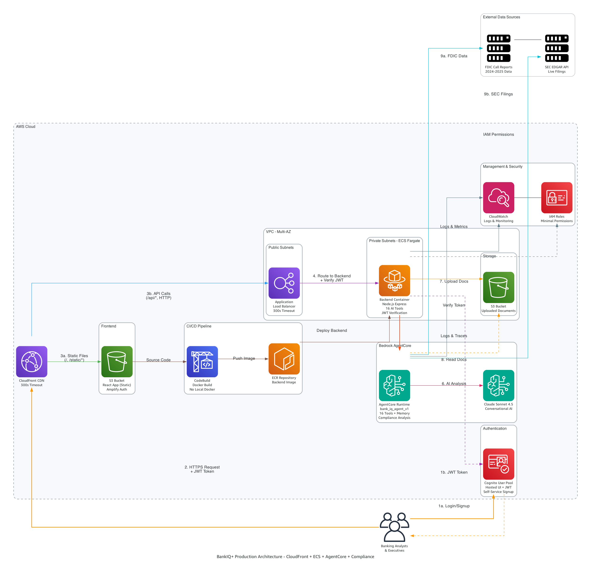

# BankIQ+ - AI Banking Analytics Platform (**Powered by [Amazon Bedrock AgentCore](https://aws.amazon.com/bedrock/agentcore/)**) 


**Authors:** Shashi Makkapati, Senthil Kamala Rathinam, Jacob Scheatzle

> **Technology Showcase**: This project demonstrates the capabilities of **Amazon Bedrock AgentCore** (AWS's new managed agent runtime) and the **Strands framework** for building production-ready AI agents with tool orchestration, conversational memory, and enterprise-grade security.

## 🚀 Why This Project Matters

### Amazon Bedrock AgentCore + Strands Framework
This is a **reference implementation** showcasing:
- **Amazon Bedrock AgentCore** - AWS's newly launched managed agent runtime (announced October 2025)
- **Strands Framework** - Python-based agent orchestration with 20 custom tools
- **Production Architecture** - CloudFront + ECS + Cognito + AgentCore (no API Gateway)
- **Conversational Memory** - Multi-turn conversations with context retention
- **Tool Orchestration** - Claude Sonnet 4.5 automatically selects from 20 specialized tools
- **Enterprise Security** - Bedrock Guardrails, JWT authentication, IAM roles, private subnets

### Banking Analytics Use Case
The advent of Generative AI has revolutionized how financial institutions process and interpret complex banking data. BankIQ+ represents a paradigm shift from traditional rule-based analytics to intelligent, context-aware financial analysis. By integrating Amazon Bedrock AgentCore with Claude Sonnet 4.5, real-time FDIC data, and SEC EDGAR filings, the platform doesn't just present numbers—it understands relationships between metrics, identifies emerging trends, and generates human-like insights.

The AI agent can instantly correlate a bank's declining Net Interest Margin with industry-wide patterns, explain strategic implications of capital changes, or predict potential regulatory concerns based on CRE concentration trends. This GenAI-powered approach transforms raw regulatory data into conversational insights, enabling bank executives to ask natural language questions like "Why is our ROA underperforming compared to similar-sized banks?" and receive comprehensive, contextual analysis that considers market conditions, regulatory environment, and peer performance.


## 🏗️ AWS Architecture




### Architecture Deep Dive

BankIQ+ follows a modern, cloud-native architecture built on AWS services with security-first design. User requests flow through [CloudFront](https://docs.aws.amazon.com/AmazonCloudFront/latest/DeveloperGuide/Introduction.html) for global content delivery, routing static files from [S3](https://docs.aws.amazon.com/s3/) and API calls to the [Application Load Balancer](https://docs.aws.amazon.com/elasticloadbalancing/latest/application/introduction.html). The ALB distributes traffic to containerized applications running on [Amazon ECS Fargate](https://docs.aws.amazon.com/AmazonECS/latest/developerguide/AWS_Fargate.html), eliminating server management while providing automatic scaling.

The platform's intelligence comes from [Amazon Bedrock AgentCore](https://aws.amazon.com/bedrock/agentcore/), which orchestrates 20 specialized tools for banking analytics. The agent uses [Claude Sonnet 4.5](https://www.anthropic.com/claude) for natural language understanding and maintains conversational memory across sessions. External data integration includes FDIC APIs for real-time banking metrics and SEC EDGAR APIs for financial filings. Documents uploaded to S3 are analyzed using PyPDF2 for metadata extraction and Claude for comprehensive analysis.

Security is embedded throughout: [AWS Cognito](https://docs.aws.amazon.com/cognito/) provides enterprise-grade authentication with OAuth 2.0 and JWT tokens, [Bedrock Guardrails](https://docs.aws.amazon.com/bedrock/latest/userguide/guardrails.html) filter harmful content and block inappropriate requests, Fargate containers run in private subnets with JWT verification, [IAM roles](https://docs.aws.amazon.com/IAM/latest/UserGuide/introduction.html) provide fine-grained access control, and [CloudWatch](https://docs.aws.amazon.com/cloudwatch/) enables comprehensive monitoring. The architecture eliminates API Gateway's 30-second timeout limitation, supporting long-running queries up to 300 seconds. Infrastructure is deployed through [CloudFormation](https://docs.aws.amazon.com/cloudformation/) templates, ensuring consistent, repeatable deployments.

## 🛠️ Technology Stack

### Core AI Platform (NEW AWS Services)
- **[Amazon Bedrock AgentCore](https://aws.amazon.com/bedrock/agentcore/)** - Managed agent runtime with built-in memory and tool orchestration
- **[Amazon Bedrock Guardrails](https://docs.aws.amazon.com/bedrock/latest/userguide/guardrails.html)** - Content filtering, topic blocking, and PII protection
- **[Strands Framework](https://github.com/awslabs/agents-for-amazon-bedrock-sample-code)** - Python agent framework for defining tools and workflows
- **[Claude Sonnet 4.5](https://www.anthropic.com/claude)** - Foundation model for natural language understanding and reasoning

### Application Stack
- **Authentication**: [AWS Cognito](https://docs.aws.amazon.com/cognito/) + [AWS Amplify v6](https://aws.amazon.com/amplify/) (OAuth 2.0 + JWT)
- **Backend**: [Express.js](https://expressjs.com/) (Node.js) + Python agent
- **Frontend**: [React](https://react.dev/) + [Material-UI](https://mui.com/) + AWS Amplify Auth
- **Infrastructure**: [ECS Fargate](https://docs.aws.amazon.com/AmazonECS/latest/developerguide/AWS_Fargate.html), [ALB](https://docs.aws.amazon.com/elasticloadbalancing/latest/application/), [CloudFront](https://docs.aws.amazon.com/cloudfront/), [S3](https://docs.aws.amazon.com/s3/)
- **Vector Store**: [OpenSearch Serverless](https://docs.aws.amazon.com/opensearch-service/latest/developerguide/serverless.html) (for RAG knowledge base)
- **Security**: [Bedrock Guardrails](https://docs.aws.amazon.com/bedrock/latest/userguide/guardrails.html), [VPC](https://docs.aws.amazon.com/vpc/) private subnets, JWT verification, [IAM roles](https://docs.aws.amazon.com/IAM/latest/UserGuide/id_roles.html), [Security Groups](https://docs.aws.amazon.com/vpc/latest/userguide/vpc-security-groups.html)

## 📚 Documentation

Complete documentation is available in the **[docs/](docs/)** folder:

- **[Deployment Guide](docs/DEPLOYMENT_GUIDE.md)** - Step-by-step deployment instructions
- **[CloudFormation Guide](docs/CLOUDFORMATION_GUIDE.md)** - Infrastructure details and scripts
- **[Agent Development](docs/AGENT_DEVELOPMENT.md)** - Building and extending the AI agent

## ✨ Platform Features

### 📊 Peer Bank Analytics
- **500+ Banks**: Access entire SEC EDGAR database
- **Live FDIC Data**: Real-time financial metrics and trends
- **Custom CSV Upload**: Analyze your own peer data
- **AI-Powered Comparison**: Automated tool selection by Claude

### 📋 Financial Reports
- **SEC Filings**: 10-K and 10-Q analysis for any public bank
- **Document Upload**: Analyze your own financial PDFs
- **RAG Expansion**: One-click to add any bank (500+) to RAG knowledge base
- **Conversational Memory**: Context-aware across queries
- **AI Chat**: Interactive Q&A about uploaded documents

### 🛡️ Compliance & Audit Dashboard
- **Regulatory Risk Assessment**: Real-time compliance scoring using FDIC data
- **Capital Adequacy Analysis**: Tier 1 capital ratios and regulatory thresholds
- **Risk Temperature Gauges**: Visual risk indicators for capital, liquidity, and credit
- **Regulatory Alerts**: Automated compliance monitoring and alerts


## 🎯 AI Agent Tools (20 Custom Tools + RAG)

**Strands Framework Implementation** - Each tool is a Python function with:
- Input/output schemas (Pydantic models)
- Error handling and validation
- Integration with external APIs (FDIC, SEC EDGAR)
- S3 operations for document storage

**FDIC & Live Data (4):**
1. `get_fdic_data` - Current FDIC banking data (live API integration)
2. `get_bank_fdic_data` - Get FDIC data for specific bank
3. `search_fdic_bank` - Search FDIC by bank name
4. `compare_banks_live_fdic` - Live FDIC peer comparison

**Peer Comparison (2):**
5. `compare_banks_local_csv` - Compare banks using uploaded CSV
6. `compare_banks` - Smart router (auto-selects live/local/RAG)

**SEC Filings & Search (2):**
7. `get_sec_filings` - SEC EDGAR filings (10-K, 10-Q)
8. `search_banks` - Bank search by name/ticker (500+ banks)

**CSV Upload & Analysis (3):**
9. `upload_peer_csv_data` - Upload peer comparison CSV
10. `upload_csv_to_s3` - Direct S3 CSV upload
11. `analyze_csv_peer_performance` - Analyze custom CSV data

**PDF Upload & Analysis (3):**
12. `analyze_and_upload_pdf` - Upload and analyze PDFs (PyPDF2 + Claude)
13. `upload_document_to_s3` - Direct S3 document upload
14. `extract_pdf_text` - Extract text from PDFs

**Data Retrieval (2):**
15. `get_local_document_data` - Get uploaded document data
16. `get_rag_data` - Get RAG knowledge base data

**Compliance & Audit (3):**
17. `compliance_risk_assessment` - Real-time compliance scoring
18. `regulatory_alerts_monitor` - Monitor regulatory thresholds
19. `audit_document_analyzer` - Analyze audit findings and compliance

**RAG Knowledge Base (1):**
20. `query_rag_knowledge_base` - Query Bedrock Knowledge Base with semantic search

**Tool Orchestration**: Claude Sonnet 4.5 automatically selects the right tool(s) based on user intent. For example:
- "Compare JPMorgan and Bank of America ROA" → `compare_banks` tool
- "What are Webster's key risks?" → `get_sec_filings` + `query_rag_knowledge_base` tools
- "Analyze my custom peer data" → `upload_csv_to_s3` + `analyze_csv_peer_performance` tools
- "Show me compliance risks for Chase" → `get_bank_fdic_data` + `compliance_risk_assessment` tools

### 🧠 RAG Mode (Included)
**Bedrock Knowledge Base** with pre-indexed SEC filings:
- **Coverage**: Top 10 banks, Oct 2024-Oct 2025 (40 filings)
- **Speed**: Instant semantic search (pre-indexed vectors)
- **One-Click Expansion**: Add any bank from SEC EDGAR (500+) to RAG index with one click
- **Tools**: `chat_with_rag_knowledge_base`, `generate_rag_indexed_report`
- **Fallback**: Automatically uses Live SEC EDGAR for other banks
- **Deployment**: Auto-deployed with main stack

**Add Banks to RAG**: Search for any bank in the SEC database and add their Oct 2024-Oct 2025 filings to the RAG knowledge base with a single click. The system automatically downloads and indexes the filings.

See [RAG Integration Guide](docs/RAG_INTEGRATION.md) for details.

## 🛡️ Bedrock Guardrails (Content Safety)

BankIQ+ uses **Amazon Bedrock Guardrails** to ensure safe, compliant AI interactions:

### Protection Layers

**Content Filtering:**
- ✅ Hate speech, insults, violence (HIGH strength)
- ✅ Sexual content, misconduct (MEDIUM-HIGH strength)
- ✅ Prompt injection attacks (HIGH strength)

**Topic Blocking:**
- 🚫 **Financial Advice** - No investment recommendations or stock picks
- 🚫 **Legal Advice** - No legal counsel or regulatory interpretation
- 🚫 **Tax Advice** - No tax planning or optimization strategies
- 🚫 **Personal Finance** - No budgeting or debt management advice

**Word Filtering:**
- Blocks phrases like "buy this stock", "guaranteed returns", "risk-free investment"
- Filters profanity using AWS managed word lists

**PII Protection:**
- 🔒 **BLOCK**: SSN, credit cards, bank accounts, routing numbers
- 🔒 **ANONYMIZE**: Email, phone, names, addresses

### Custom Messaging
**Blocked Input:** "I can only provide banking data analysis. I cannot provide financial advice, investment recommendations, or discuss inappropriate topics."

**Blocked Output:** "I cannot provide that type of information. I can only assist with factual banking data analysis and metrics."

### Guardrails Status

Guardrails are **automatically deployed** during the main deployment process:

✅ **Auto-Deployed**: The deploy-all.sh script automatically:
1. Creates the Bedrock Guardrail with content filtering, topic blocking, and PII protection
2. Attaches the guardrail to the AgentCore agent
3. Configures all security policies

**Test Guardrail:**
```bash
cd backend
agentcore invoke '{"prompt": "Should I buy JPMorgan stock?"}'
# Expected: Blocked with custom message
```

**Manual Management (Optional):**
If you need to recreate or update guardrails:
```bash
# Recreate guardrail
python3 cfn/scripts/create-bedrock-guardrail.py

# Reattach to agent
bash cfn/scripts/attach-guardrail-to-agent.sh
```

## 🌟 Amazon Bedrock AgentCore Highlights

### What is AgentCore?
Amazon Bedrock AgentCore is a **managed agent runtime** that handles:
- ✅ **Tool Orchestration** - Automatically routes requests to the right tools
- ✅ **Conversational Memory** - Maintains context across multi-turn conversations
- ✅ **Streaming Responses** - Real-time token streaming for better UX
- ✅ **Content Safety** - Bedrock Guardrails for harmful content filtering
- ✅ **Error Handling** - Automatic retries and graceful degradation
- ✅ **Observability** - Built-in CloudWatch logging and tracing
- ✅ **Scalability** - Serverless, auto-scaling infrastructure

### Why AgentCore vs. Custom Agent?
| Feature | Custom Agent | Amazon Bedrock AgentCore |
|---------|-------------|---------------|
| Infrastructure | You manage | AWS manages |
| Memory | Build yourself | Built-in |
| Tool routing | Manual logic | Automatic (Claude) |
| Scaling | Configure yourself | Auto-scales |
| Monitoring | Setup CloudWatch | Pre-integrated |
| Cost | EC2/Lambda costs | Pay per invocation |

### Strands Framework Benefits
- **Type Safety** - Pydantic schemas for all tool inputs/outputs
- **Easy Testing** - Test tools independently before deployment
- **Version Control** - Agent code in Git, deployed via CLI
- **Hot Reload** - Update agent without infrastructure changes
- **Local Development** - Test locally before deploying to AWS


## 🚀 Deployment Guide

### Prerequisites

**Required:**
- AWS Account with administrative access
- AWS Bedrock access enabled (see setup below)
- AWS CLI configured (`aws configure`)
- Node.js 18+ (for frontend build)
- Python 3.11+ (for AgentCore CLI)
- AgentCore CLI: `pip install bedrock-agentcore-starter-toolkit`

### Install Prerequisites

**Mac/Linux:**
```bash
# Install Homebrew (if not installed)
/bin/bash -c "$(curl -fsSL https://raw.githubusercontent.com/Homebrew/install/HEAD/install.sh)"

# Install required tools
brew install awscli node python@3.11 git

# Install Python dependencies
pip install bedrock-agentcore-starter-toolkit boto3 beautifulsoup4 requests lxml
```

**Windows (PowerShell as Administrator):**
```powershell
# Install Chocolatey + all tools
Set-ExecutionPolicy Bypass -Scope Process -Force; [System.Net.ServicePointManager]::SecurityProtocol = [System.Net.ServicePointManager]::SecurityProtocol -bor 3072; iex ((New-Object System.Net.WebClient).DownloadString('https://community.chocolatey.org/install.ps1'))
choco install python git awscli nodejs jq -y

# Install Python dependencies
pip install bedrock-agentcore-starter-toolkit boto3 beautifulsoup4 requests lxml

# Add Python Scripts to PATH permanently (for agentcore command)
echo 'export PATH="$PATH:/d/Users/$USER/AppData/Roaming/Python/Python314/Scripts"' >> ~/.bashrc
source ~/.bashrc
```

**Enable Bedrock Access:**
1. Go to [AWS Bedrock Console](https://console.aws.amazon.com/bedrock/)
2. Navigate to **Model Access** in the left sidebar
3. Click **Request model access**
4. Enable: **Anthropic Claude Sonnet 4.5**
5. Wait for approval (usually instant)

### Step-by-Step Deployment

**Step 1: Clone Repository**
```bash
git clone https://github.com/smakkapati-repo/hackathon-code-agent-core.git
cd hackathon-code-agent-core
```

**Step 2: Configure AWS CLI**
```bash
aws configure
# Enter your AWS Access Key ID
# Enter your AWS Secret Access Key
# Enter region: us-east-1 (or your preferred region: us-west-2, eu-west-1, etc.)
# Enter output format: json
```

**Step 3: Deploy Everything (One Command)**

**Mac/Linux:**
```bash
./cfn/scripts/deploy-all.sh
```

**Windows (Git Bash):**
```bash
# Set region explicitly (required for Windows Git Bash)
export AWS_DEFAULT_REGION=us-east-1  # or your preferred region
./cfn/scripts/deploy-all.sh
```

**Note:** The deployment automatically:
- Creates Cognito User Pool for authentication
- Deploys infrastructure (VPC, ALB, ECS, S3, ECR)
- Downloads 40 SEC filings and creates RAG Knowledge Base
- Deploys AgentCore agent with 20 tools
- Creates and attaches Bedrock Guardrails
- Builds and deploys backend container
- Builds and deploys frontend to S3 + CloudFront

**Deployment Progress:**
- 🔵 **[0/4] Auth (Cognito)** (~2-3 minutes)
  - Creates Cognito User Pool
  - Configures OAuth 2.0 authentication
  - Sets up Hosted UI

- 🔵 **[1/4] Infrastructure** (~10-15 minutes)
  - VPC with public/private subnets
  - Application Load Balancer
  - ECS cluster
  - S3 buckets (frontend, uploaded-docs, sec-filings)
  - ECR repositories
  - OpenSearch Serverless collection (vector store for RAG)
  - IAM roles (ECS, AgentCore, Bedrock KB)

- 🔵 **[2/4] Agent + RAG** (~10-15 minutes, parallel execution)
  - Downloads 40 SEC filings (top 10 banks)
  - Creates Bedrock Knowledge Base + starts ingestion
  - Builds and deploys Python agent with 20 tools
  - Adds S3 permissions automatically
  - Creates conversational memory

- 🔵 **[3/4] Backend** (~7-10 minutes)
  - Creates CodeBuild project
  - Uploads source to S3
  - Builds Docker image via CodeBuild
  - Pushes to ECR
  - Deploys ECS service

- 🔵 **[4/4] Frontend** (~2-3 minutes)
  - Builds React app
  - Uploads to S3
  - Creates CloudFront distribution
  - Updates Cognito callback URLs

**Total Time**: ~30-40 minutes

**Step 4: Access Your Application**

After deployment completes, you'll see:
```
✅ DEPLOYMENT COMPLETE WITH COGNITO!
🌐 Application URL: https://[your-cloudfront-url].cloudfront.net
🔐 Login URL: https://bankiq-auth-[account-id].auth.us-east-1.amazoncognito.com
```

**Next Steps:**
1. Visit the Application URL
2. Click 'Sign In with AWS Cognito'
3. Click 'Sign up' to create your account
4. Verify your email and log in

## 🔍 Verify Deployment

**Check Health:**

**Mac/Linux:**
```bash
# Get CloudFront URL
CLOUDFRONT_URL=$(aws cloudfront list-distributions --query "DistributionList.Items[?contains(Origins.Items[0].DomainName, 'bankiq-frontend')].DomainName" --output text)

# Test health endpoint
curl https://$CLOUDFRONT_URL/api/health
# Expected: {"status":"healthy","service":"BankIQ+ Backend"}
```

**Windows (PowerShell):**
```powershell
# Get CloudFront URL
$CLOUDFRONT_URL = aws cloudfront list-distributions --query "DistributionList.Items[?contains(Origins.Items[0].DomainName, 'bankiq-frontend')].DomainName" --output text

# Test health endpoint
Invoke-WebRequest -Uri "https://$CLOUDFRONT_URL/api/health"
```

**View Logs (All Platforms):**
```bash
# ECS backend logs
aws logs start-live-tail --log-group-identifiers /ecs/bankiq-backend

# AgentCore logs
agentcore status
```

## ⚡ Performance & Caching

BankIQ+ uses **node-cache** for in-memory caching to dramatically improve performance:

- **SEC Filings**: 2000ms → 1ms (24 hour cache)
- **Bank Search**: 500ms → 1ms (7 day cache)
- **FDIC Data**: 1500ms → 1ms (1 hour cache)

**Cache Management:**
```bash
# View cache statistics
curl http://localhost:3001/api/admin/cache-stats

# Clear all caches
curl -X POST http://localhost:3001/api/admin/clear-cache \
  -H "Content-Type: application/json" \
  -d '{"type": "all"}'
```

## 💰 Cost Estimate

Monthly costs (24/7 operation):
- ECS Fargate: $15-20
- ALB: $16-20
- CloudFront: $1-5
- S3: $1-2
- Bedrock: $10-30

**Total**: ~$50-90/month

## 🧹 Cleanup

To delete all resources:

```bash
# Run from project root directory
./cfn/scripts/cleanup.sh
```

This will remove:
- ✅ CloudFormation stacks (frontend, backend, infrastructure, auth)
- ✅ Cognito User Pool and all users
- ✅ S3 buckets (with contents)
- ✅ ECR images and repositories
- ✅ ECS cluster and services
- ✅ CloudFront distribution
- ✅ AgentCore agent
- ✅ All associated resources

**Time**: ~10-15 minutes

## 📝 Monitoring

```bash
# View ECS logs
aws logs tail /ecs/bankiq-backend --follow

# View AgentCore logs
cd backend
agentcore status
```


## 🆘 Troubleshooting

**Issue**: CloudFront returns 502
- Check ECS task health
- Check ALB target health
- View logs: `aws logs start-live-tail --log-group-identifiers /ecs/bankiq-backend`

**Issue**: Agent not responding
- Check AgentCore status: `cd backend && agentcore status`
- Verify agent ARN in ECS task environment variables

For detailed troubleshooting, see the [Deployment Guide](docs/DEPLOYMENT_GUIDE.md).

## 📄 License

Apache License 2.0

## 👥 Authors

Shashi Makkapati, Senthil Kamala Rathinam, Jacob Scheatzle
