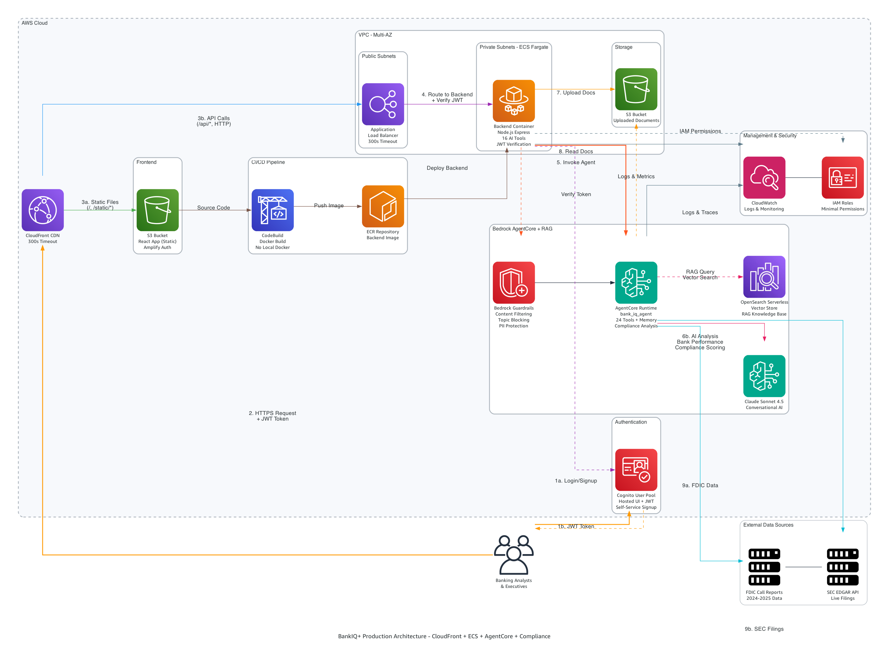

# BankIQ+ AI Banking Analytics Platform
## Executive Business Case

**Authors:** Shashi Makkapati, Senthil Kamala Rathinam, Jacob Scheatzle  
**Date:** January 2025

---

## The Banking Analytics Challenge

Financial institutions today face an unprecedented challenge in analyzing and interpreting the vast amounts of regulatory and competitive data required for strategic decision-making. Bank executives, risk officers, and analysts spend countless hours manually consolidating data from disparate sources—FDIC Call Reports, SEC filings, internal systems, and third-party databases—only to produce static reports that are outdated by the time they reach decision-makers. Traditional analytics platforms require specialized technical skills, offer limited contextual understanding, and cannot answer the natural language questions that executives actually ask. This fragmentation creates a critical gap between data availability and actionable insights, resulting in delayed strategic decisions, missed competitive opportunities, and reactive rather than proactive risk management. The banking industry needs a transformative solution that can instantly synthesize complex financial data, understand relationships between metrics, and deliver conversational insights that enable faster, more informed decision-making.

## Introducing BankIQ+: Conversational AI for Banking Analytics

BankIQ+ is a cloud-native AI analytics platform built on Amazon Bedrock AgentCore and Claude Sonnet 4.5 that transforms how banks analyze performance, assess regulatory compliance, and benchmark against peers. Unlike traditional analytics tools that require SQL queries and manual report generation, BankIQ+ enables executives to ask natural language questions like "Why is our Net Interest Margin declining compared to peer banks?" and receive comprehensive, context-aware answers in seconds. The platform integrates real-time FDIC data for 500+ banks, SEC EDGAR filings, and custom document uploads into a unified conversational interface powered by 24 specialized AI tools. By leveraging generative AI and AWS's newest managed services, BankIQ+ delivers instant insights that previously required days of analyst time, while maintaining enterprise-grade security through Bedrock Guardrails, AWS Cognito authentication, and VPC private subnets. The platform represents a paradigm shift from reactive data reporting to proactive intelligence, enabling bank executives to make faster, more informed strategic decisions based on comprehensive analysis of regulatory, competitive, and operational data.

## Comprehensive Peer Bank Analytics and Competitive Intelligence

At the core of BankIQ+ is a powerful peer analytics engine that provides instant access to financial performance data for over 500 banks from the SEC EDGAR database and real-time FDIC Call Reports. The platform automatically identifies relevant peer groups based on asset size, geography, and business model, then analyzes key metrics including profitability (ROA, ROE, Net Interest Margin), capital adequacy (Tier 1 ratios), asset quality (NPL ratios, loan loss reserves), liquidity (loan-to-deposit ratios), and growth trends across multiple quarters. What sets BankIQ+ apart is its AI-powered contextual understanding—rather than simply presenting raw numbers, the platform explains why metrics changed, identifies industry-wide patterns, and highlights outliers that warrant attention. For example, when analyzing a declining Net Interest Margin, the agent automatically correlates this with peer performance, interest rate environment changes, and loan portfolio composition shifts to provide a comprehensive explanation. Banks can also upload custom CSV files with proprietary peer data, enabling analysis of non-public institutions or specialized peer groups. This comprehensive competitive intelligence capability transforms strategic planning, M&A due diligence, and board reporting from time-consuming manual processes into instant, data-driven insights.

## Intelligent Document Analysis and RAG Knowledge Base

BankIQ+ extends beyond structured financial data to provide sophisticated analysis of unstructured documents including SEC 10-K and 10-Q filings, internal financial reports, audit findings, and board presentations. The platform automatically retrieves SEC filings for any public bank, extracts key information from Management Discussion & Analysis sections, identifies risk factors, and summarizes strategic initiatives—all through natural language queries. Users can upload custom PDF documents for AI-powered analysis, with the system extracting metadata, generating summaries, and enabling conversational Q&A about document contents. The platform's Retrieval-Augmented Generation (RAG) capability takes this further by maintaining a vector-based knowledge base of pre-indexed SEC filings for the top 10 banks, enabling instant semantic search across 40+ filings without the latency of real-time retrieval. This RAG knowledge base is expandable with one-click indexing—users can search for any bank in the SEC database and add their Oct 2024-Oct 2025 filings to the knowledge base instantly. The combination of live document retrieval, custom uploads, and pre-indexed RAG search provides unparalleled flexibility for financial analysis, enabling executives to quickly understand competitive strategies, identify emerging risks, and benchmark their institution's disclosures against industry leaders.

## Real-Time Compliance Monitoring and Regulatory Risk Assessment

Regulatory compliance is a critical concern for financial institutions, and BankIQ+ addresses this through a comprehensive Compliance & Audit Dashboard that provides real-time risk assessment based on FDIC data and regulatory thresholds. The platform continuously monitors capital adequacy ratios (Tier 1 > 6%, Total Risk-Based Capital > 10%), liquidity indicators (Loan-to-Deposit ratios), credit concentrations (CRE loans, construction loans), and asset quality metrics (NPL ratios, charge-offs) against regulatory minimums and peer benchmarks. Visual risk indicators including temperature gauges and color-coded alerts (green/yellow/red) provide at-a-glance assessment of the institution's regulatory posture, while trend charts show risk trajectory over time. The platform generates proactive alerts when metrics approach regulatory limits or deviate significantly from peer averages—for example, notifying risk officers when the NPL ratio reaches 2x the peer average or when Tier 1 capital trends toward the well-capitalized threshold. This shifts compliance monitoring from reactive quarterly reviews to continuous, proactive oversight. Additionally, the platform's AI-powered audit document analyzer can review audit findings, identify compliance gaps, and track remediation status, providing a comprehensive view of the institution's risk and compliance posture that supports board reporting, regulatory examinations, and strategic risk management.

## Enterprise-Grade Security and AI Guardrails

Security and responsible AI use are paramount in financial services, and BankIQ+ implements multiple layers of protection to ensure safe, compliant operations. The platform leverages Amazon Bedrock Guardrails to filter harmful content (hate speech, violence, sexual content, prompt injection attacks), block inappropriate topics (financial advice, legal counsel, tax advice, personal finance recommendations), and protect personally identifiable information by automatically blocking SSNs, credit card numbers, and bank account numbers while anonymizing emails, phone numbers, and addresses. All user authentication flows through AWS Cognito with OAuth 2.0 and JWT tokens, ensuring enterprise-grade identity management with multi-factor authentication support. The infrastructure follows AWS security best practices with VPC private subnets for backend containers, IAM roles with least-privilege permissions, Security Groups for network isolation, and CloudWatch logging for comprehensive audit trails. Data encryption is enforced both in transit (TLS 1.3) and at rest (S3 server-side encryption, OpenSearch encryption), with all data stored in US AWS regions to meet data residency requirements. This security-first architecture ensures that BankIQ+ meets the stringent requirements of financial institutions while enabling the transformative benefits of generative AI for banking analytics.

## Advanced AI Architecture: Amazon Bedrock AgentCore and Claude Sonnet 4.5

BankIQ+ is built on Amazon Bedrock AgentCore, AWS's newly launched managed agent runtime announced in October 2025, which provides built-in conversational memory, automatic tool orchestration, and serverless scaling without the operational overhead of custom agent implementations. The platform leverages Claude Sonnet 4.5 as its foundation model, providing advanced natural language understanding, a 200K token context window for analyzing long documents, and sophisticated reasoning capabilities for complex financial analysis. The agent architecture implements 24 specialized tools using the Strands framework—a Python-based agent development framework that provides type-safe tool definitions with Pydantic schemas, easy testing and version control, and hot reload capabilities for updating tools without infrastructure changes. When a user asks a question, Claude automatically selects the appropriate tools based on intent—for example, a query about peer ROA comparison triggers the compare_banks tool, which intelligently routes to live FDIC data, uploaded CSV files, or the RAG knowledge base depending on data availability. This intelligent tool orchestration eliminates the need for users to understand which data sources or analysis methods to use; the AI agent handles all complexity behind a simple conversational interface. The platform also implements streaming responses for real-time user experience and maintains conversational memory across sessions, enabling natural follow-up questions that reference previous context.

## Cloud-Native Infrastructure and Deployment Automation

The BankIQ+ platform is architected as a modern, cloud-native application leveraging AWS services for scalability, reliability, and operational efficiency. User requests flow through Amazon CloudFront for global content delivery with 300-second timeout support for long-running queries, routing static files from S3 and API calls to an Application Load Balancer that distributes traffic to containerized applications running on Amazon ECS Fargate. This serverless compute model eliminates server management while providing automatic scaling based on demand. The backend is built with Node.js Express.js and implements aggressive caching using node-cache, reducing query latency from 2000ms to 1ms for frequently accessed data like SEC filings and bank searches. The platform uses OpenSearch Serverless for vector storage supporting the RAG knowledge base, with S3 buckets for uploaded documents and SEC filings. Infrastructure deployment is fully automated through CloudFormation templates and a one-command deployment script that provisions all resources—VPC, subnets, load balancers, ECS clusters, S3 buckets, ECR repositories, Cognito user pools, and the AgentCore agent—in 30-40 minutes. A corresponding cleanup script ensures complete resource deletion for cost management. The CI/CD pipeline uses AWS CodeBuild for Docker image builds targeting ARM64 architecture, with automatic ECS service updates on code changes. This infrastructure-as-code approach ensures consistent, repeatable deployments and enables rapid iteration on features while maintaining production stability.

## Quantifiable Business Value and Return on Investment

BankIQ+ delivers measurable business value through dramatic reductions in analysis time and associated cost savings. Peer bank analysis that traditionally required 2-3 days of analyst work is completed in 2-3 minutes—a 99% time reduction. Regulatory compliance reviews that took 4 hours are now completed in 10 minutes (96% reduction), SEC filing analysis drops from 1 hour to 2 minutes (97% reduction), and custom report generation falls from 2 hours to 5 minutes (96% reduction). For a mid-sized bank with 2-3 analysts dedicated to financial analysis and reporting, these time savings translate to $200K-$500K in annual cost savings. Additionally, the platform can replace third-party analytics platforms costing $100K-$500K annually, providing further cost reduction. Beyond direct cost savings, BankIQ+ delivers significant value through improved decision-making speed—faster loan pricing decisions based on peer benchmarking, accelerated M&A target identification and due diligence, and enhanced board reporting that enables more strategic discussions. The platform also reduces risk through proactive compliance monitoring that identifies potential regulatory concerns before they become enforcement actions, early detection of asset quality deterioration, and peer comparison alerts for emerging industry risks. With monthly operating costs of only $50-90 for AWS infrastructure, the platform delivers exceptional ROI with payback periods measured in weeks rather than years.

## Real-World Use Cases Across Banking Functions

BankIQ+ serves multiple stakeholders across banking organizations with use cases spanning strategic planning, risk management, M&A, and portfolio management. For CEOs and executive teams preparing for quarterly board meetings, the platform provides comprehensive peer analysis in 10 minutes versus 2 days, delivering data-driven talking points and competitive intelligence for strategic planning discussions. Chief Risk Officers use the real-time compliance dashboard to monitor capital adequacy, liquidity ratios, and credit concentrations against regulatory thresholds, with automated report generation for board audit committees. CFOs evaluating potential acquisition targets leverage the platform to rapidly screen banks based on financial criteria, analyze loan portfolio composition, extract risk factors from SEC filings, and compare deposit growth rates across multiple targets—transforming M&A due diligence from a weeks-long process to a matter of hours. Chief Lending Officers optimize loan pricing by analyzing peer Net Interest Margins, assessing CRE concentration relative to peers, monitoring NPL ratios for banks with similar portfolios, and understanding the relationship between loan growth and asset quality. These diverse use cases demonstrate how BankIQ+ serves as a unified analytics platform that breaks down data silos and enables cross-functional insights that were previously impossible without significant manual effort and specialized technical skills.

## Implementation Roadmap and Organizational Adoption

Deploying BankIQ+ follows a structured four-phase approach designed to minimize disruption while maximizing value realization. Phase 1 (Week 1) focuses on technical deployment, leveraging CloudFormation automation to provision infrastructure, deploy the agent with 24 tools, initialize the RAG knowledge base, and configure user authentication through AWS Cognito. Phase 2 (Week 2) addresses data integration and validation, including FDIC data verification, SEC filing retrieval testing, custom CSV upload validation, and document analysis quality assurance. Phase 3 (Weeks 3-4) centers on user onboarding with executive training sessions demonstrating key use cases, analyst workflow integration to incorporate the platform into existing processes, custom peer group configuration based on the institution's strategic focus, and compliance dashboard setup aligned with the bank's risk framework. Phase 4 (Week 5+) involves production rollout with phased user access expansion, performance monitoring and optimization based on actual usage patterns, feedback collection and feature refinement, and expansion of bank coverage in the RAG knowledge base. This phased approach ensures that technical, operational, and organizational change management aspects are addressed systematically, with clear success criteria at each stage and opportunities to adjust based on early feedback before full-scale deployment.

## Competitive Differentiation and Market Position

BankIQ+ occupies a unique position in the banking analytics market by combining the latest advances in generative AI with comprehensive financial data coverage and enterprise-grade security. Traditional analytics platforms like S&P Global Market Intelligence, Moody's Analytics, and FIS require specialized training, offer limited natural language capabilities, and charge $100K-$500K annually with restrictive licensing. Custom-built internal solutions demand significant development resources, lack the sophisticated AI capabilities of foundation models like Claude Sonnet 4.5, and require ongoing maintenance and scaling infrastructure. BankIQ+ differentiates through its conversational interface that requires no technical training, comprehensive data coverage spanning 500+ banks with real-time FDIC and SEC data, AI-powered contextual understanding that explains "why" rather than just presenting "what," flexible deployment options with full infrastructure automation, and transparent, cost-effective pricing at $50-90/month for AWS infrastructure versus six-figure annual contracts. The platform's use of Amazon Bedrock AgentCore—AWS's newest managed service—provides built-in capabilities like conversational memory, tool orchestration, and automatic scaling that would require months of custom development. Additionally, the Bedrock Guardrails integration ensures responsible AI use with content filtering, topic blocking, and PII protection that meets financial services compliance requirements. This combination of cutting-edge AI technology, comprehensive data integration, enterprise security, and operational simplicity positions BankIQ+ as a transformative solution for banking analytics that delivers immediate value while providing a foundation for future AI-powered capabilities.

## Strategic Vision and Future Roadmap

BankIQ+ represents the first step in a broader vision for AI-powered banking intelligence that extends beyond analytics to encompass predictive modeling, scenario analysis, and automated regulatory reporting. The current platform establishes the foundational capabilities—conversational AI interface, comprehensive data integration, tool orchestration, and enterprise security—that enable future enhancements. Near-term roadmap items include expanding the RAG knowledge base to cover all 500+ banks in the SEC database, integrating additional data sources such as FFIEC call reports and state banking department filings, developing predictive models for key metrics like loan loss provisions and deposit growth, and implementing automated regulatory report generation for CAMELS ratings and stress testing. Medium-term enhancements will focus on multi-bank portfolio analysis for holding companies, integration with core banking systems for real-time internal data analysis, custom tool development frameworks enabling banks to build proprietary analytics, and white-label deployment options for banks to offer the platform to their commercial customers. Long-term vision includes industry-wide benchmarking capabilities aggregating anonymized data across participating institutions, systemic risk monitoring for regulators and industry groups, and AI-powered strategic planning tools that simulate the impact of business decisions on financial performance and regulatory ratios. This roadmap ensures that BankIQ+ evolves with the needs of financial institutions while maintaining its core value proposition of making complex banking analytics accessible through simple, conversational AI interactions that empower faster, more informed decision-making across all levels of the organization.

---

## Technical Architecture Overview

*Figure 1: BankIQ+ Production Architecture - CloudFront + ECS + AgentCore + Compliance*

## Implementation and Deployment Details

The BankIQ+ platform is designed for rapid deployment with minimal technical overhead through comprehensive automation and infrastructure-as-code practices. The entire deployment process is orchestrated through a single command that executes CloudFormation templates to provision all AWS resources in a specific sequence: first, the authentication layer with AWS Cognito User Pool and OAuth 2.0 configuration (2-3 minutes); second, the core infrastructure including VPC with public/private subnets, Application Load Balancer, ECS cluster, S3 buckets for frontend and documents, ECR repositories, OpenSearch Serverless collection for vector storage, and IAM roles for ECS and AgentCore (10-15 minutes); third, the AI agent deployment with parallel execution of SEC filing downloads for the top 10 banks, Bedrock Knowledge Base creation with automatic ingestion, Python agent build with 24 specialized tools using the Strands framework, S3 permissions configuration, and conversational memory initialization (10-15 minutes); fourth, the backend deployment through CodeBuild project creation, Docker image build targeting ARM64 architecture, ECR push, and ECS Fargate service deployment with health checks (7-10 minutes); and finally, the frontend deployment with React application build, S3 upload, CloudFront distribution creation with 300-second timeout configuration, and automatic Cognito callback URL updates (2-3 minutes). The total deployment time is approximately 30-40 minutes, with all resources tagged for cost tracking and organized for easy management.

Post-deployment configuration is minimal but flexible, allowing organizations to customize the platform to their specific needs. The Bedrock Guardrails feature is optional and can be enabled after initial deployment by running a Python script that creates the guardrail with content filtering, topic blocking, word filtering, and PII protection policies, then updating the agent configuration file to reference the guardrail identifier and version before redeploying the agent with a single command. Organizations can expand the RAG knowledge base beyond the initial 10 banks by using the platform's search interface to find any bank in the SEC EDGAR database and clicking a single button to download and index their Oct 2024-Oct 2025 filings, with the ingestion process completing in the background. Custom peer groups can be configured by uploading CSV files with proprietary banking data, and the platform automatically detects the schema and makes the data available for analysis through the AI agent. User access is managed through AWS Cognito with self-service signup, email verification, and optional multi-factor authentication, with administrators able to configure user pools, groups, and permissions through the AWS Console or CLI.

Operational management is streamlined through AWS-native monitoring and automation capabilities. CloudWatch Logs capture all application logs from the ECS backend and AgentCore agent, with log retention configurable from 1 day to indefinite based on compliance requirements. The GenAI Observability Dashboard provides specialized monitoring for agent performance including invocation counts, latency percentiles, tool usage statistics, and error rates, with X-Ray tracing enabled for detailed request flow analysis. The platform implements aggressive caching through node-cache in the backend, reducing query latency from 2000ms to 1ms for frequently accessed data like SEC filings and bank searches, with cache statistics available through admin endpoints and manual cache clearing supported for data refresh scenarios. Cost management is simplified through resource tagging and AWS Cost Explorer integration, with monthly operating costs typically ranging from $50-90 for 24/7 operation including ECS Fargate compute ($15-20), Application Load Balancer ($16-20), CloudFront distribution ($1-5), S3 storage ($1-2), Bedrock API calls ($10-30), and OpenSearch Serverless ($5-10). The platform includes a comprehensive cleanup script that deletes all resources in the correct dependency order—frontend, backend, backend CodeBuild, authentication, and infrastructure stacks—with automatic S3 bucket emptying, ECR repository deletion, AgentCore agent destruction, and verification of complete resource removal, typically completing in 10-15 minutes and ensuring no residual costs.

---

**For more information or to schedule a demonstration, please contact:**

Shashi Makkapati  
Email: shamakka@amazon.com  
GitHub: https://github.com/smakkapati-repo/hackathon-code-agent-core

---

*Document Version 1.0 | January 2025 | Confidential and Proprietary*
